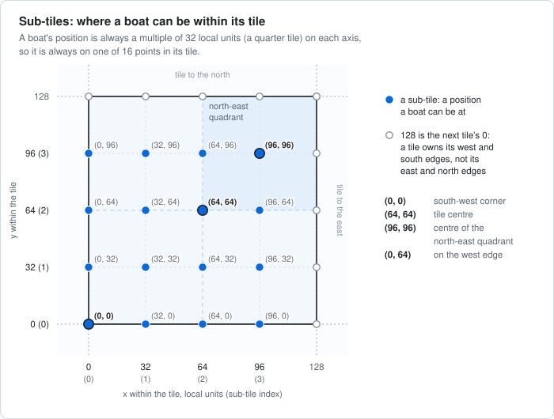
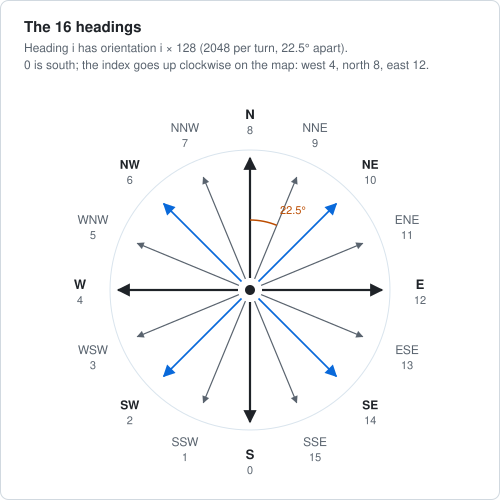
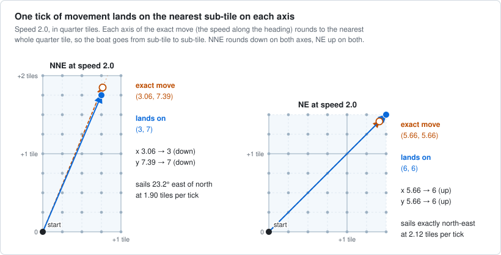
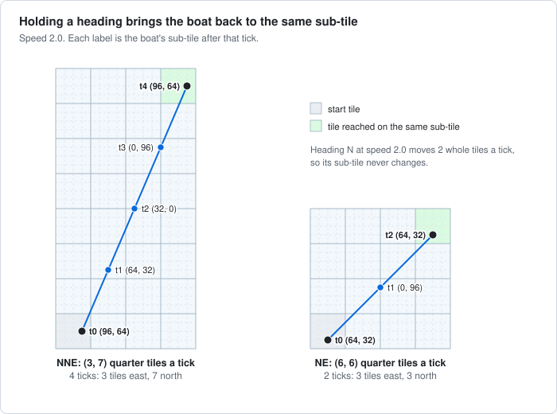
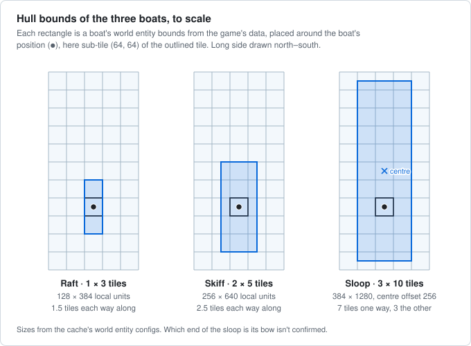
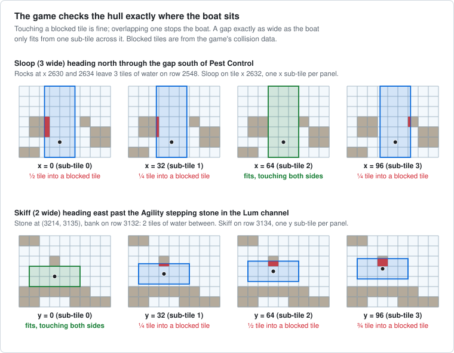
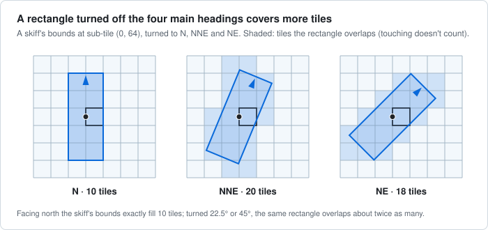

# Sailing mechanics

How player-owned boats are positioned, steered and moved in Old School RuneScape, and how obstacles stop them. Everything stated here has been observed in game, read from the game's own data and client, or stated by Jagex. Anything else is listed under [Not yet confirmed](#not-yet-confirmed), including what other sources claim.

**Units**

- A **tile** is 128 local units; a **quarter tile** is 32.
- **Orientations** are in the game's angle units, 2048 per full turn: 0 is south, 512 west, 1024 north and 1536 east.
- A **tick** is 0.6 seconds. Speeds are in tiles per tick.
- x grows east and y grows north. "(x, y) in a tile" means local units from the tile's south-west corner.

## Positions: sub-tiles

A boat's position is a point, and it is always a multiple of 32 local units on each axis. Within its tile, a boat can only be at x and y of 0, 32, 64 or 96. This page calls these 16 points **sub-tiles**, and numbers them 0 to 3 on each axis (the value divided by 32).

- (0, 0) is the tile's south-west corner, (64, 64) its centre and (96, 96) the centre of its north-east quadrant.
- 128 is the next tile's 0. A tile owns the sub-tiles on its west and south edges, but not those on its east and north edges.



- **Sub-tiles are points, not cells.** At x = 0 the boat sits exactly on its tile's west edge, and at x = 64 exactly on its centre line. Only the four sub-tiles with both values 32 or 96 lie strictly inside a quadrant.
- **The tile containing a position** is the position divided by 128, rounded down, on each axis. The remainder is the sub-tile.

## Headings

A boat always faces one of 16 headings, 22.5° apart. Heading *i* has orientation *i* × 128. 0 is south and the index increases clockwise on the map: S, SSW, SW, WSW, W (4), WNW, NW, NNW, N (8), NNE, NE, ENE, E (12), ESE, SE, SSE.



- **Steering.** At the helm, clicking the game world gives a "Set heading" option, which points the boat at one of the 16 headings in the direction of the click. The boat holds that heading until it's stopped, turned or blocked. There's no pathfinding; a click only chooses a direction.
- **Turning.** A turn of one or two headings takes one tick per heading (22.5°), and on each of those ticks the boat already moves along its new heading. Turning from N to NE at speed 2.0, for example, it moves (3, 7) quarter tiles on the first tick, heading NNE, and (6, 6) on the second, heading NE.

## Moving

Each tick the boat moves a whole number of quarter tiles on each axis, so it goes from sub-tile to sub-tile. At speed 2.0:

| Heading | Per tick, quarter tiles east and north | Direction | Tiles per tick |
|---|---|---|---:|
| N | (0, 8) | due north | 2.00 |
| NNE | (3, 7) | 23.2° east of north, not 22.5° | 1.90 |
| NE | (6, 6) | due north-east | 2.12 |

Each of these is the exact move (the speed along the heading) rounded to the nearest whole quarter tile on each axis. For NNE that rounds down on both axes; for NE, up on both:



**No remainder carries over between ticks.** At speed 2.0, while the heading stays the same, every tick moves exactly the same amount: heading NNE, (3, 7) quarter tiles every tick. If the game kept the exact position and only rounded where the boat landed, y would sometimes move 8.

## Holding a heading: the sub-tile cycle

When every tick moves the same whole number of quarter tiles, holding a heading for *k* ticks moves the boat *k* times that. The boat is back on the sub-tile it started from once the total is whole tiles on both axes, which takes 1, 2 or 4 ticks. Four always works, since 4 quarter tiles make a tile. In between, the boat passes through other sub-tiles, often on tile edges. At speed 2.0:

- **N** moves 2 whole tiles a tick, so its sub-tile never changes.
- **NE** is back on its sub-tile every 2 ticks, 3 tiles east and 3 north.
- **NNE** is back every 4 ticks, 3 tiles east and 7 north.



A turn made while moving usually changes the boat's sub-tile, because the boat spends a tick moving along each heading in between.

## Speeding up and slowing down

A boat can take several ticks to reach full speed, and several to stop.

- **Speeding up.** For example, a boat setting off north from rest can move 2, then 4, 6 and 8 quarter tiles over its first four ticks. That's 0.5 tiles per tick faster each tick, up to 2.0.
- **Slowing down.** For example, a boat stopping from speed 2.0 heading NNE can move (2, 4), then (2, 3), then (1, 1) quarter tiles before it stops, taking 3 ticks. No speed rounds to (2, 3) in the NNE direction, so these steps don't follow the rounding seen at full speed.

## Hulls

Each boat has world entity bounds in the game's data: a rectangle in the boat's own frame, placed around the boat's position, with one side across the boat and one along it.

| Boat | Config id | Size, across × along (local units) | Tiles | Centre offset along the boat | Reach from the boat's position |
|---|---:|---|---|---:|---|
| Raft | 1 | 128 × 384 | 1 × 3 | 0 | ½ tile each side, 1.5 each way along |
| Skiff | 2 | 256 × 640 | 2 × 5 | 0 | 1 tile each side, 2.5 each way along |
| Sloop | 3 | 384 × 1280 | 3 × 10 | −256 | 1½ tiles each side, 7 one way along and 3 the other |



### Collisions

The game checks a boat's hull exactly where the boat is, at its sub-tile, not at its tile's centre. A boat whose hull would overlap a blocked tile is stopped at the obstacle. Touching a blocked tile's edge is allowed. Across the boat, the hull is exactly as wide as its bounds, and it lies across the boat's heading:

- **Pest Control.** South of Pest Control, rocks at x 2630 and 2634 leave a 3-tile gap on row 2548. A sloop sailing north fits through only at x = 64 in its tile, where its 3-tile hull exactly fills the gap. At 0, 32 or 96 it stops at the rocks.
- **Lum Lagoon.** In the channel from the Lumbridge Basin, an Agility stepping stone at (3214, 3135) leaves 2 tiles of water above the bank. A skiff sailing east along row 3134 fits past at y = 0 in its tile, where its 2-tile hull exactly fills the gap.



So a gap exactly as wide as the boat only fits from one sub-tile across it: on its tile's centre line (64) for the 3-wide sloop, and on its tile's edge (0) for the 2-wide skiff. From the other sub-tiles the hull would overlap the obstacle by a quarter tile or more.

**Boat size.** Some passages fit only smaller boats: the channels between the islands of the Elid Delta fit a skiff but not a sloop.

**Blocked tiles.** The rocks south of Pest Control and the stepping stone in the Lum channel are blocked tiles in the game's collision data, and they stop boats.

## Reading boat state in RuneLite

| What | How |
|---|---|
| On a boat | Varbit `SAILING_BOARDED_BOAT` (19136) is 1, or the player's `WorldView` isn't `WorldView.TOPLEVEL` |
| The boat | `client.getTopLevelWorldView().worldEntities().byIndex(player.getWorldView().getId())`, a `WorldEntity` |
| Position this tick | `boat.getTargetLocation()`, in top-level local units; the sub-tile is `& 127`. The client interpolates `getLocalLocation()` toward it between ticks |
| Heading | `boat.getTargetOrientation() / 128`, from 0 to 15. `getOrientation()` is the interpolated value |
| Bounds | `boat.getConfig()`, a `WorldEntityConfig`: `getId()` (1 raft, 2 skiff, 3 sloop) and `getBoundsX/Y/Width/Height` |
| Speed stats | Varbits `SAILING_SIDEPANEL_BOAT_BASESPEED` (19250), `SAILING_SIDEPANEL_BOAT_SPEEDCAP` (19251) and `SAILING_SIDEPANEL_BOAT_ACCELERATION` (19257). The side panel shows each divided by 128 |

- **Local coordinates follow the loaded scene.** When the scene reloads, they jump by whole tiles, for example by 32 tiles (4096 units). The sub-tile stays the same, so convert to world coordinates before comparing positions across ticks.
- **The deck has its own coordinates.** The player's own position on deck is in the boat's world view. `boat.transformToMainWorld(...)` maps a point on the boat to the sea.

## Not yet confirmed

Nothing in this section is established. Claims from other sources are labelled with where they come from.

### Movement

- **Other speeds and headings.** Only N, NNE and NE at speed 2.0 are confirmed, including that every tick moves the same amount. Chart Plotter's code gives a formula that reproduces those three, and a community spreadsheet reportedly gives the same one:

  ```text
  vx = 32 * round( round(-SINE[o]   * speed / 512) / 32 )
  vy = 32 * round( round(-COSINE[o] * speed / 512) / 32 )
  ```

  - `o` is the orientation.
  - `SINE` and `COSINE` are the game's tables, scaled by 65536 (RuneLite's `Perspective.SINE` and `Perspective.COSINE`).
  - `round` goes to the nearest whole number, with halves away from zero.

  The formula predicts these per-tick moves, in quarter tiles. By the formula, the other 13 headings mirror these.

  | Speed | N | NNE | NE |
  |---:|---|---|---|
  | 0.5 | (0, 2) | (1, 2) | (1, 1) |
  | 1.0 | (0, 4) | (2, 4) | (3, 3) |
  | 1.5 | (0, 6) | (2, 6) | (4, 4) |
  | 2.5 | (0, 10) | (4, 9) | (7, 7) |
  | 3.0 | (0, 12) | (5, 11) | (9, 9) |
  | 3.5 | (0, 14) | (5, 13) | (10, 10) |
  | 4.0 | (0, 16) | (6, 15) | (11, 11) |

- **Exact halves.** By that formula, the diagonals at speed 3.0 come to exactly 8.5 quarter tiles (272 local units) before the last rounding, and round to 9. The spreadsheet reportedly notes that the game once gave 9 for NE but 8 for SW, and that this was later fixed.

### Turning

- **Longer turns.** Is the rate still one heading per tick for turns of more than two headings?
- **Direction.** Does the boat always turn the shorter way, and which way does it turn for a half turn?
- **At rest.** Does a stopped boat turn on the spot? The OSRS Wiki's Sailing page describes the boat rotating to its new direction before it starts moving.
- **Boat types.** Does every boat turn at the same rate?

### Speed

- **Side panel stats.** Does a boat at full sail with no boosts move its base speed in tiles per tick? Is the acceleration stat the per-tick gain (0.5 in the example above)?
- **Documented values.** The OSRS Wiki's Shipbuilding page says:
  - base speed depends on the hull, from 1.5 for a wooden hull to 3.0 for rosewood;
  - each burst of speed, from rapids, crystal motes and the like, adds 0.5;
  - bursts stack up to the hull's speed cap, and one stack decays every 4 ticks;
  - a wind boost adds 0.5 when moving forwards and ignores the speed cap;
  - acceleration is 0.5 or 1.0, depending on the mast and sails.

  Chart Plotter models sailing slowly as 1.0 and reversing as 0.5.
- **Slowing down.** The general rule for slowing down is unknown. The OSRS Wiki's Sailing page says toggling the sails stops the boat immediately, but the example above took 3 ticks.

### Hulls and collisions

- **Length and the sloop's offset.** Does the hull's length match the bounds? Does the sloop's 2-tile offset point toward the bow (reaching 7 tiles ahead and 3 behind) or the stern?
- **The raft.** Is the raft's hull as wide as its 1-tile bounds?
- **Other headings.** Does the game turn the hull to diagonal headings? If it turns the bounds rectangle, the rectangle covers more tiles:

  

  How a turned rectangle's corners are rounded also matters. Turning with the game's integer sine table and turning by exact angles cover different tiles in some cases. For example, a skiff facing NNE at sub-tile (64, 64) covers 20 tiles one way and 19 the other.
- **Between ticks.** Is the hull checked along the whole move, or only where the boat lands each tick?
- **Small overlaps.** Facing N, E, S or W, every overlap is a whole number of quarter tiles. Does a smaller overlap, which only other headings can make, stop the boat?
- **Stopping.** Where exactly does a blocked boat stop: at its last position before the overlap, or up against the obstacle? Does it keep turning?
- **Which tiles block boats.** In the walking collision data, open sea is open and a strip 1–2 tiles wide along each coast is blocked. Do boats use exactly these flags everywhere? Do walls block boats?
- **Docking.** How close to a dock must a boat be to disembark?

## Sources

- [Behind the Scenes of Sailing: Volume 1](https://oldschool.runescape.wiki/w/Update:Behind_the_Scenes_of_Sailing:_Volume_1), Jagex's dev blog: 16 headings, quarter-tile movement, no pathfinding.
- Game cache dumps ([Joshua-F/osrs-dumps](https://github.com/Joshua-F/osrs-dumps)):
  - world entity bounds (`config/dump.worldentity`);
  - side panel stats (`script/[proc,sailing_sidepanel_get_stat].cs2`).
- [RuneLite's API](https://github.com/runelite/runelite/tree/master/runelite-api/src/main/java/net/runelite/api): `WorldEntity`, `WorldEntityConfig`, `WorldView` and `gameval/VarbitID`.
- [Chart Plotter](https://github.com/Dazuzi/chart-plotter), for the unconfirmed formula (`ChartPlotterMath`) and reverse speed.
- The OSRS Wiki pages [Sailing](https://oldschool.runescape.wiki/w/Sailing) and [Shipbuilding](https://oldschool.runescape.wiki/w/Shipbuilding), for the unconfirmed speeds.
